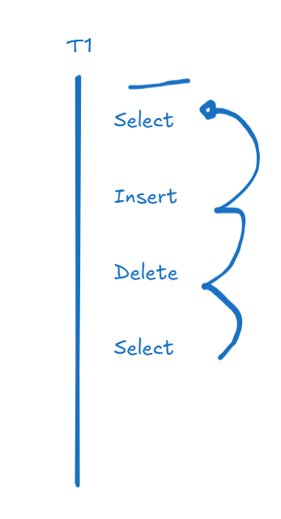
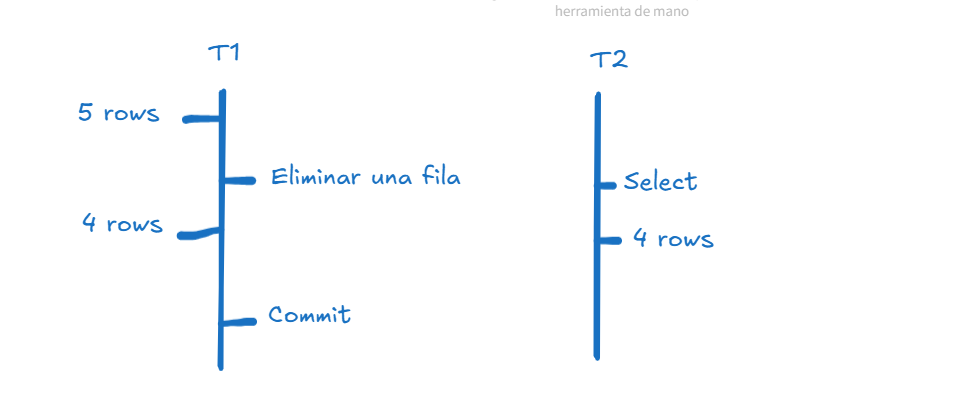
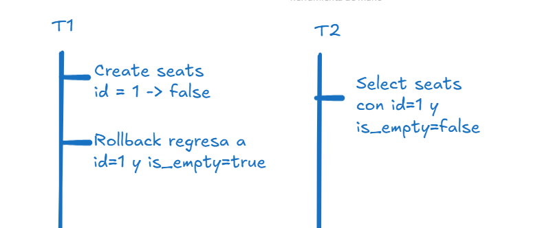

# Transacciones ACID
* A - Atomicidad: Varios pasos validos
* C - Completar: Terminar el proceso si o si
* I - Integridad: Aislar los procesos
* D - Durability: Que siempre nos dara el mismo resultado

## Commit 
Realizar los procesos y cambios en la BD, darle fin a la transaccion y subir los cambios.
## Rollback
Si ocurre un error, se realiza el rollback a un estado anterior antes de realizar los cambios.

# Niveles de aislamiento

Un SP es una transaccion

### READ UNCOMMITED
Leer los cambios que no estan comiteadas. 

En Postgres no permite por leer data sucia y no cumpla con ACID

### READ COMPLETED
Lee el utiimo dato comiteado en la BD
### Repeatable READ
Snapshot, saca una foto al momento de empezar la transaccion.
### SERIALIZE
Bloquea tanto la lectura como escritura cuando se toca una fila
